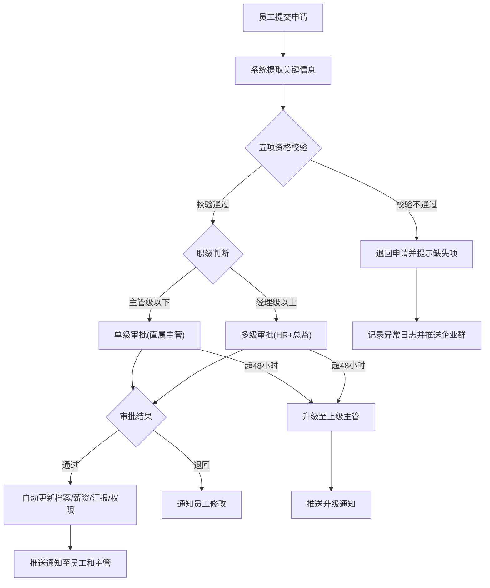
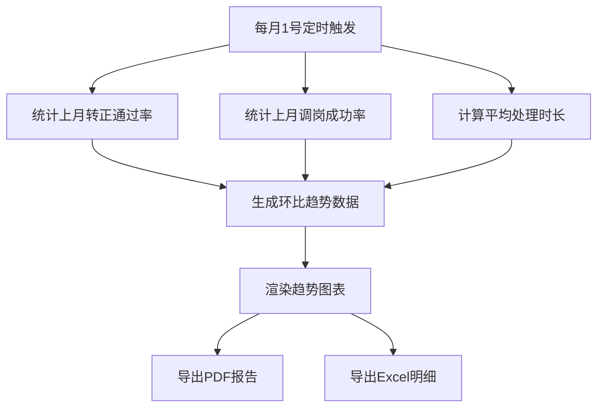

## 1. 产品概述

员工转正调岗审批管理系统，面向企业HR部门和各级管理者，实现员工转正与调岗申请的自动接收、智能校验、分级审批、档案更新与统计报表全流程数字化管理。解决传统人工审批流程效率低、易遗漏、缺乏数据支撑的问题，提升人事管理效率和合规性。

## 2. 核心功能

### 2.1 用户角色

| 角色 | 注册方式 | 核心权限 |
|------|----------|----------|
| 普通员工 | 系统分配账号 | 提交转正/调岗申请、查看个人申请状态 |
| 主管 | 系统分配账号 | 审批下属申请、查看部门申请统计 |
| HR专员 | 系统分配账号 | 校验申请资格、管理审批流程、生成报表 |
| HR总监 | 系统分配账号 | 审批经理级以上申请、查看全局报表 |
| 系统管理员 | 系统分配账号 | 管理用户权限、系统配置、日志审计 |

### 2.2 功能模块

1. **工作台仪表盘**：关键指标概览、待办事项、异常提醒、快捷入口
2. **申请管理**：转正申请提交、调岗申请提交、申请状态跟踪、退回修改
3. **审批中心**：待审批列表、审批操作（通过/退回）、审批记录、超时升级提醒
4. **资格校验**：绩效达标校验、培训完成校验、主管评价校验、技能匹配度校验、部门编制校验
5. **员工档案**：员工信息管理、薪资级别更新、汇报关系更新、系统权限更新
6. **统计报表**：转正通过率、调岗成功率、平均处理时长、环比趋势图、PDF/Excel导出
7. **查询导出**：按员工编号/部门/时间段组合查询、批量导出明细
8. **系统日志**：操作日志记录、异常实时推送、审批超时告警

### 2.3 页面详情

| 页面名称 | 模块名称 | 功能描述 |
|----------|----------|----------|
| 工作台仪表盘 | 关键指标卡片 | 显示待审批数、本月转正数、本月调岗数、超时预警数 |
| 工作台仪表盘 | 待办事项列表 | 展示当前用户的待办审批任务，支持快速跳转 |
| 工作台仪表盘 | 异常提醒面板 | 展示审批超时、条件不满足等异常，实时更新 |
| 工作台仪表盘 | 快捷入口 | 一键进入提交申请、审批中心、报表查询 |
| 转正申请页 | 申请表单 | 填写员工编号、试用期满日期、自我评价、附件上传 |
| 转正申请页 | 资格校验结果 | 自动展示五项校验结果（绩效/培训/评价/技能/编制） |
| 调岗申请页 | 申请表单 | 填写员工编号、原部门/岗位、目标部门/岗位、调岗原因 |
| 调岗申请页 | 资格校验结果 | 自动展示五项校验结果及目标部门编制情况 |
| 审批中心 | 待审批列表 | 按紧急程度排序，显示申请人、类型、等待时长、超时标记 |
| 审批中心 | 审批详情面板 | 查看申请详情、校验结果、审批意见填写 |
| 审批中心 | 审批记录 | 历史审批操作记录，含时间、审批人、意见 |
| 员工档案页 | 档案列表 | 按部门/职级筛选，显示员工基本信息和当前状态 |
| 员工档案页 | 档案详情 | 完整档案信息，含薪资级别、汇报关系、权限变更历史 |
| 统计报表页 | 月度统计概览 | 转正通过率、调岗成功率、平均处理时长，含环比数据 |
| 统计报表页 | 趋势图表 | 柱状图/折线图展示近12个月趋势变化 |
| 统计报表页 | 报表导出 | 支持导出PDF和Excel格式报告 |
| 查询导出页 | 高级查询 | 按员工编号、部门、时间段、申请类型、状态组合筛选 |
| 查询导出页 | 结果列表 | 查询结果以表格形式展示，支持分页和排序 |
| 查询导出页 | 批量导出 | 勾选记录后一键导出Excel明细 |
| 系统日志页 | 操作日志 | 按时间/类型/用户筛选操作记录 |
| 系统日志页 | 异常日志 | 审批超时、条件不满足等异常记录，含推送状态 |
| 通知中心 | 通知列表 | 审批结果通知、升级通知、系统通知 |

## 3. 核心流程

### 3.1 转正/调岗申请流程

员工提交申请后，系统自动提取关键信息，根据预设的五项条件进行资格校验。校验不通过则退回申请并提示缺失项；校验通过后根据职级和变动类型自动分配审批流程：主管级以下走单级审批（直属主管），经理级以上走多级审批（HR + 总监）。审批超过48小时未处理自动升级至上级主管。审批通过后自动更新员工档案、薪资级别、汇报关系和系统权限，并推送通知。

### 3.2 月度报表生成流程

## 4. 用户界面设计

### 4.1 设计风格

- **主色调**：深蓝 (#1E3A5F) 搭配科技蓝 (#3B82F6)，传达专业、可信赖的企业管理气质
- **辅助色**：成功绿 (#10B981)、警告橙 (#F59E0B)、错误红 (#EF4444)、中性灰 (#6B7280)
- **按钮风格**：圆角微弧(8px)，主按钮填充色，次按钮描边，危险操作红色
- **字体**：标题使用 Noto Sans SC Bold，正文使用 Noto Sans SC Regular，数据展示使用 JetBrains Mono
- **布局风格**：左侧固定导航栏 + 顶部面包屑 + 内容区卡片式布局
- **图标风格**：线性图标(Lucide)，24px主图标，16px辅助图标

### 4.2 页面设计概览

| 页面名称 | 模块名称 | UI元素 |
|----------|----------|--------|
| 工作台仪表盘 | 关键指标卡片 | 4列网格卡片，数字大字号+趋势箭头，悬停阴影加深，渐变背景 |
| 工作台仪表盘 | 待办事项列表 | 列表卡片，左侧色条标识优先级，右侧操作按钮，超时项红色闪烁 |
| 工作台仪表盘 | 异常提醒面板 | 右侧浮动面板，异常类型图标+描述+时间，新异常滑入动画 |
| 转正/调岗申请页 | 申请表单 | 分步表单，步骤条指示进度，校验结果实时显示，通过项绿勾/未通过项红叉 |
| 审批中心 | 待审批列表 | 表格布局，行悬停高亮，超时行左侧红色边框，批量操作工具栏 |
| 审批中心 | 审批详情 | 侧滑面板，申请信息+校验结果+审批流+意见框，底部通过/退回按钮 |
| 统计报表页 | 趋势图表 | 柱状图/折线图混合，悬浮提示框，图例切换，时间范围选择器 |
| 查询导出页 | 高级查询 | 折叠式筛选面板，输入框/下拉框/日期选择器组合，查询结果表格分页 |
| 系统日志页 | 操作日志 | 时间轴+表格混合布局，日志类型标签彩色标识，筛选器顶部固定 |

### 4.3 响应式设计

- 桌面优先设计，主要支持1920px/1440px/1280px宽度
- 仪表盘卡片在窄屏下从4列自动调整为2列/1列
- 表格在窄屏下支持横向滚动
- 侧滑面板在移动端全屏展示

## 5. 非功能性需求

- 审批超时检测精度：每小时扫描一次
- 报表生成时间：月度报表60秒内完成
- 查询响应时间：组合查询3秒内返回
- 日志保留：操作日志保留2年，异常日志保留3年
- 通知推送延迟：5秒内送达
