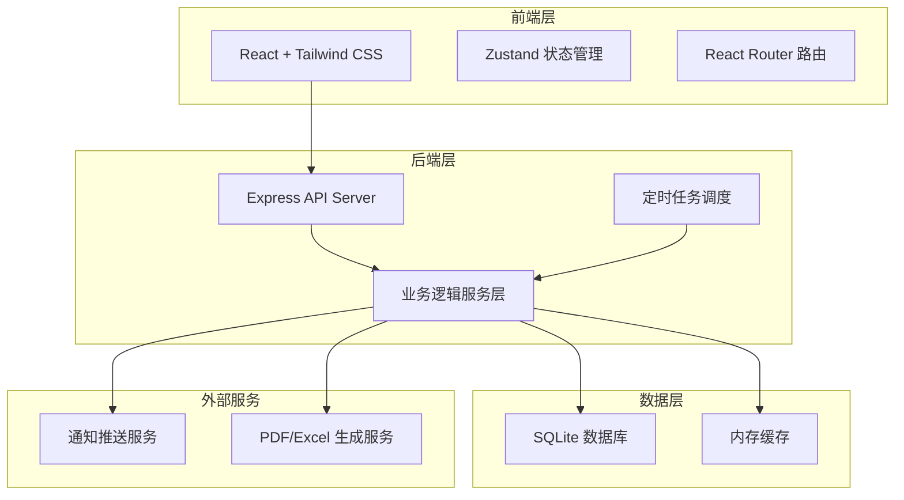
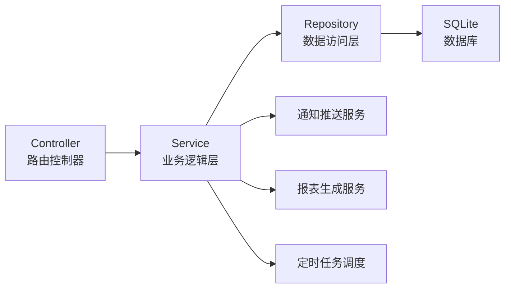
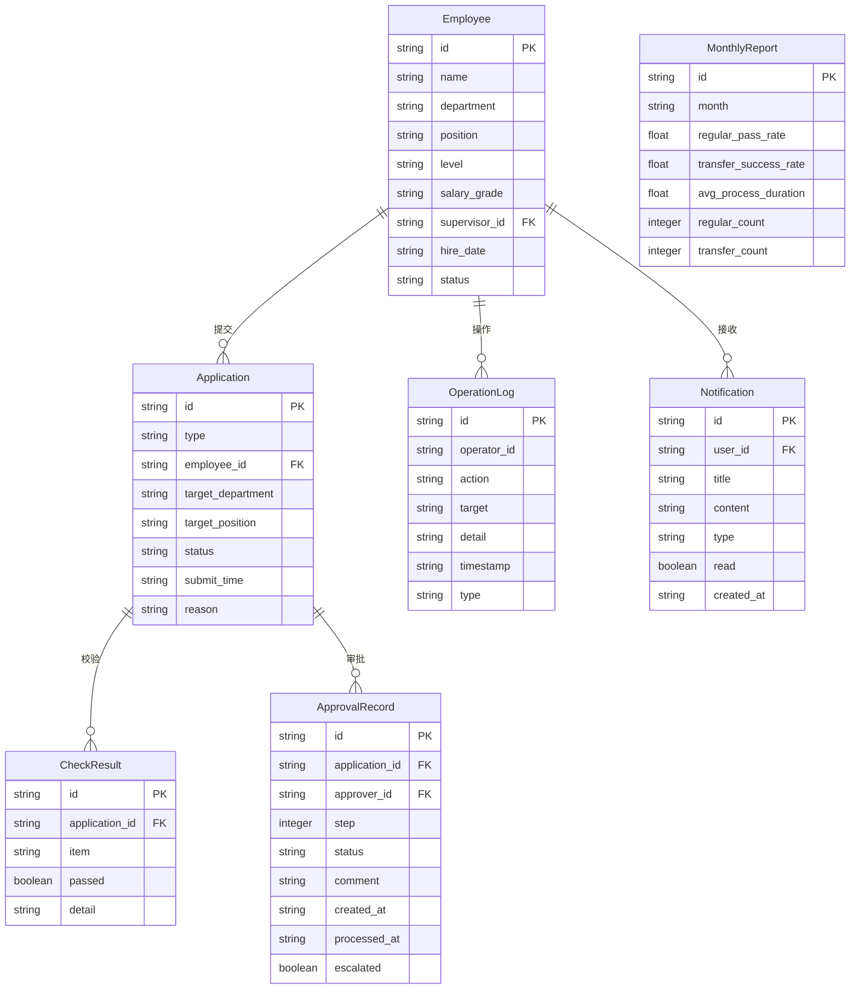

## 1. 架构设计



## 2. 技术说明

- **前端**：React@18 + Tailwind CSS@3 + Vite
- **初始化工具**：vite-init
- **后端**：Express@4 + TypeScript (ESM)
- **数据库**：SQLite (better-sqlite3)，使用 mock 数据初始化
- **状态管理**：Zustand
- **路由**：React Router DOM
- **图表**：Recharts
- **PDF生成**：pdfmake
- **Excel导出**：xlsx (SheetJS)
- **定时任务**：node-cron
- **图标**：lucide-react

## 3. 路由定义

| 路由 | 用途 |
|------|------|
| `/` | 工作台仪表盘，关键指标和待办概览 |
| `/apply/regular` | 提交转正申请 |
| `/apply/transfer` | 提交调岗申请 |
| `/approval` | 审批中心，待审批列表和审批操作 |
| `/approval/:id` | 审批详情页 |
| `/employee` | 员工档案列表 |
| `/employee/:id` | 员工档案详情 |
| `/reports` | 统计报表，含趋势图表和导出 |
| `/query` | 高级查询与批量导出 |
| `/logs` | 系统日志和异常记录 |
| `/notifications` | 通知中心 |

## 4. API定义

### 4.1 申请相关

```typescript
interface Application {
  id: string;
  type: "regular" | "transfer";
  employeeId: string;
  employeeName: string;
  department: string;
  position: string;
  targetDepartment?: string;
  targetPosition?: string;
  level: "staff" | "supervisor" | "manager" | "director";
  submitTime: string;
  status: "pending_check" | "check_failed" | "pending_approval" | "approved" | "rejected" | "escalated";
  checkResults: CheckResult[];
  reason?: string;
  attachments?: string[];
}

interface CheckResult {
  item: "performance" | "training" | "evaluation" | "skill_match" | "headcount";
  label: string;
  passed: boolean;
  detail: string;
}

// POST /api/applications - 提交申请
// GET /api/applications - 获取申请列表（支持筛选）
// GET /api/applications/:id - 获取申请详情
// PUT /api/applications/:id/status - 更新申请状态
```

### 4.2 审批相关

```typescript
interface ApprovalRecord {
  id: string;
  applicationId: string;
  approverId: string;
  approverName: string;
  approverRole: string;
  step: number;
  status: "pending" | "approved" | "rejected";
  comment?: string;
  createdAt: string;
  processedAt?: string;
  escalated: boolean;
}

// POST /api/approvals/:id/approve - 审批通过
// POST /api/approvals/:id/reject - 审批退回
// GET /api/approvals/pending - 获取待审批列表
// GET /api/approvals/history - 获取审批历史
```

### 4.3 员工档案相关

```typescript
interface Employee {
  id: string;
  name: string;
  department: string;
  position: string;
  level: "staff" | "supervisor" | "manager" | "director";
  salaryGrade: string;
  supervisorId: string;
  supervisorName: string;
  hireDate: string;
  status: "probation" | "regular" | "transferred";
  permissions: string[];
}

// GET /api/employees - 获取员工列表
// GET /api/employees/:id - 获取员工详情
// PUT /api/employees/:id - 更新员工信息
```

### 4.4 统计报表相关

```typescript
interface MonthlyReport {
  month: string;
  regularPassRate: number;
  transferSuccessRate: number;
  avgProcessDuration: number;
  regularCount: number;
  transferCount: number;
  previousMonth: {
    regularPassRate: number;
    transferSuccessRate: number;
    avgProcessDuration: number;
  };
}

// GET /api/reports/monthly - 获取月度统计
// GET /api/reports/trend - 获取趋势数据
// GET /api/reports/export/pdf - 导出PDF
// GET /api/reports/export/excel - 导出Excel
```

### 4.5 查询与日志

```typescript
interface QueryParams {
  employeeId?: string;
  department?: string;
  startDate?: string;
  endDate?: string;
  type?: "regular" | "transfer";
  status?: string;
  page?: number;
  pageSize?: number;
}

interface OperationLog {
  id: string;
  operatorId: string;
  operatorName: string;
  action: string;
  target: string;
  detail: string;
  timestamp: string;
  type: "operation" | "exception";
}

// GET /api/query - 组合查询
// GET /api/logs - 获取操作日志
// GET /api/logs/exceptions - 获取异常日志
// GET /api/query/export - 批量导出
```

### 4.6 通知相关

```typescript
interface Notification {
  id: string;
  userId: string;
  title: string;
  content: string;
  type: "approval" | "escalation" | "system" | "exception";
  read: boolean;
  createdAt: string;
}

// GET /api/notifications - 获取通知列表
// PUT /api/notifications/:id/read - 标记已读
```

## 5. 服务端架构图



## 6. 数据模型

### 6.1 数据模型定义



### 6.2 数据定义语言

```sql
CREATE TABLE employees (
  id TEXT PRIMARY KEY,
  name TEXT NOT NULL,
  department TEXT NOT NULL,
  position TEXT NOT NULL,
  level TEXT NOT NULL CHECK(level IN ('staff', 'supervisor', 'manager', 'director')),
  salary_grade TEXT NOT NULL,
  supervisor_id TEXT,
  hire_date TEXT NOT NULL,
  status TEXT NOT NULL CHECK(status IN ('probation', 'regular', 'transferred')),
  permissions TEXT DEFAULT '[]',
  created_at TEXT DEFAULT (datetime('now')),
  updated_at TEXT DEFAULT (datetime('now'))
);

CREATE TABLE applications (
  id TEXT PRIMARY KEY,
  type TEXT NOT NULL CHECK(type IN ('regular', 'transfer')),
  employee_id TEXT NOT NULL REFERENCES employees(id),
  target_department TEXT,
  target_position TEXT,
  status TEXT NOT NULL DEFAULT 'pending_check',
  submit_time TEXT DEFAULT (datetime('now')),
  reason TEXT,
  attachments TEXT DEFAULT '[]',
  created_at TEXT DEFAULT (datetime('now')),
  updated_at TEXT DEFAULT (datetime('now'))
);

CREATE TABLE check_results (
  id TEXT PRIMARY KEY,
  application_id TEXT NOT NULL REFERENCES applications(id) ON DELETE CASCADE,
  item TEXT NOT NULL,
  label TEXT NOT NULL,
  passed INTEGER NOT NULL DEFAULT 0,
  detail TEXT NOT NULL,
  created_at TEXT DEFAULT (datetime('now'))
);

CREATE TABLE approval_records (
  id TEXT PRIMARY KEY,
  application_id TEXT NOT NULL REFERENCES applications(id),
  approver_id TEXT NOT NULL REFERENCES employees(id),
  approver_name TEXT NOT NULL,
  approver_role TEXT NOT NULL,
  step INTEGER NOT NULL DEFAULT 1,
  status TEXT NOT NULL DEFAULT 'pending',
  comment TEXT,
  created_at TEXT DEFAULT (datetime('now')),
  processed_at TEXT,
  escalated INTEGER NOT NULL DEFAULT 0
);

CREATE TABLE operation_logs (
  id TEXT PRIMARY KEY,
  operator_id TEXT,
  operator_name TEXT,
  action TEXT NOT NULL,
  target TEXT,
  detail TEXT,
  timestamp TEXT DEFAULT (datetime('now')),
  type TEXT NOT NULL DEFAULT 'operation'
);

CREATE TABLE notifications (
  id TEXT PRIMARY KEY,
  user_id TEXT NOT NULL REFERENCES employees(id),
  title TEXT NOT NULL,
  content TEXT NOT NULL,
  type TEXT NOT NULL CHECK(type IN ('approval', 'escalation', 'system', 'exception')),
  read INTEGER NOT NULL DEFAULT 0,
  created_at TEXT DEFAULT (datetime('now'))
);

CREATE TABLE monthly_reports (
  id TEXT PRIMARY KEY,
  month TEXT NOT NULL UNIQUE,
  regular_pass_rate REAL NOT NULL DEFAULT 0,
  transfer_success_rate REAL NOT NULL DEFAULT 0,
  avg_process_duration REAL NOT NULL DEFAULT 0,
  regular_count INTEGER NOT NULL DEFAULT 0,
  transfer_count INTEGER NOT NULL DEFAULT 0,
  created_at TEXT DEFAULT (datetime('now'))
);

CREATE INDEX idx_applications_employee ON applications(employee_id);
CREATE INDEX idx_applications_status ON applications(status);
CREATE INDEX idx_applications_type ON applications(type);
CREATE INDEX idx_approval_records_application ON approval_records(application_id);
CREATE INDEX idx_approval_records_approver ON approval_records(approver_id);
CREATE INDEX idx_notifications_user ON notifications(user_id);
CREATE INDEX idx_notifications_read ON notifications(read);
CREATE INDEX idx_operation_logs_type ON operation_logs(type);
CREATE INDEX idx_operation_logs_timestamp ON operation_logs(timestamp);
```
